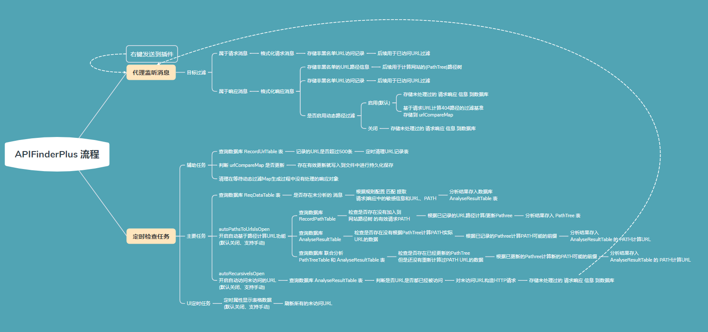

# BurpAPIFinder-Refactor

本插件参考 APIFinder UI 进行重构开发 [https://github.com/shuanx/BurpAPIFinder] 

### TODO

```
【暂时忽略】 对非200响应但存在敏感信息的请求进行处理
    对于本来就是404、405等非正常的响应、在Proxy窗口能看到的，建议使用 HAE 补充
    对于自动探测出来的URL、通过插件访问后，任何状态码都会显示对应的敏感信息
【暂时忽略】 实现自动化的 复杂的 webpack 封装JS内容分析

【已完成】1、显示每个敏感信息的提取来源（会影响去重功能、需要好好设计下）
【已完成】2、分析vue接口是否能够正常提取(正常的,是由于响应体过大截断导致的问题)、参考 https://github.com/momosecurity/FindSomething
【已完成】3、配置不要保留.vue后缀的路径、
【已完成】4、优化大文件响应体的处理
【已忽略】5、优化超多提取PATH导致性能问题
【已实现】6、修复UI刷新导致机器卡顿的问题
【已实现】7、对Json响应体继续转义恢复,便于正则提取
```


### 插件目标

做最全面的API挖掘工具、
减少手动拼接path的提取测试、
补充无法自动处理的操作、

1、支持 响应 信息中的敏感信息、URL、URI信息提取.

2、支持 自动基于 已知路径信息 计算PATH 对应的实际URL.

3、支持 自动访问 挖掘出来的URL信息 进行递归式的信息提取.

4、支持 对webpack的js的简单格式的拼接提取 （限制格式，但准确度高）

组合形式 abcd.xxxx.js


组合形式 1234.xxxx.js


### 注意事项

1、所有数据都是存储sqlite进行读写、比内存操作慢一些.

2、当目标数量过多时、执行 刷新未访问URL、自动递归扫描 任务时，占用的内存应该是较大的。

3、因为功能过多，使用请将鼠标悬浮到文本或按钮上，查看操作描述

### 基本流程 【旧版】




### 主要任务 【更新】

```
定时任务线程：
- 查询数据库 ReqDataTable 表
  - 是否存在未分析的 消息
    - 根据规则配置 匹配 提取 请求|响应中的敏感信息和URL、PATH
      - 分析结果存入数据库 AnalyseUrlResultTable 表
- 查询数据库AnalyseUrlResultTable 表
    - 将 AnalyseUrlResultTable 表中的新结果按照RootUrl分类插入到 AnalyseHostResultTable 表

- autoPathsToUrlsIsOpen 开启自动基于路径计算URL功能 (默认关闭、支持手动)
  - 查询数据库  RecordPathTable
    - 检查是否存在没有加入到 网站路径树 的有效请求PATH
      - 根据已记录的URL路径计算/更新Pathree
        - 分析结果存入 PathTree 表
        
  - 查询数据库 联合分析 PathTreeTable 和 AnalyseHostResultTable 表
    - 检查是否存在已经更新的PathTree 但是还没有重新计算过PATH URL的数据
      - 根据已更新的Pathree计算新的PATH可能的前缀
        - 分析结果存入  AnalyseHostResultTable 的 PATH计算URL 

- autoRecursiveIsOpen 开启自动访问未访问的URL
  - 查询数据库 AnalyseHostResultTable 表
    - 判断是否URL是否都已经被访问
      - 对未访问URL构造HTTP请求
```
### 内部规则说明
```
    注意：对于CONF_开头和location为config的规则，属于内部规则，不用于信息匹配。

    CONF_DEFAULT_PERFORMANCE: 默认的性能配置
        "maxPatterChunkSizeDefault=1000000",  正则匹配一次性处理的响应长度 修改保存后立即生效
        "maxStoreRespBodyLenDefault=1000000", 数据库保存响应体的最大大小 修改保存后立即生效
        "monitorExecutorIntervalsDefault=4",  几秒钟执行一次检查提取操作 修改保存后立即生效
        其他默认UI按钮相关的参数,修改保存后,重启插件生效
    
    自定义自动请求扫描的方法
        1、CONF_RECURSE_REQ_HTTP_METHODS 自定义 任意 请求方法列表支持 【每行一种请求方法】
        2、CONF_RECURSE_REQ_HTTP_PARAMS 配置禁止自动扫描的URL关键字 如【logout、del】等 防止误删除 
        3、CONF_BLACK_RECURSE_REQ_PATH_KEYS 支持自定义请求参数 【一次的请求参数写在一行即可,多行会遍历】
       注意：当前请求的请求头是基于当前URL请求体中动态获取的,后续根据用户需求添加自定义请求头功能。
  
  
    CONF_WHITE_ROOT_URL: 允许扫描的目标RootUrl关键字
    CONF_BLACK_URL_ROOT: 禁止进行[监听扫描|URL提取|PATH提取]的 RootUrl关键字
    CONF_BLACK_URL_PATH: 禁止进行[监听扫描|URL提取|PATH提取]的 URI 路径关键字
    CONF_BLACK_URL_EXT:  禁止进行[监听扫描|URL提取|PATH提取]的 URI 文件扩展名
    CONF_BLACK_AUTO_RECORD_PATH: 禁止自动进行有效PATH记录的目标RootUrl关键字
    CONF_BLACK_AUTO_RECURSE_SCAN: 禁止自动进行未访问URL扫描的目标RootUrl关键字
    CONF_WHITE_RECORD_PATH_STATUS: 允许自动进行有效PATH记录的响应状态码
    CONF_BLACK_RECORD_PATH_TITLE: 禁止自动进行有效PATH记录的响应标题
    CONF_BLACK_EXTRACT_PATH_EQUAL: 禁止提取的URI路径[等于]此项任一元素
    CONF_BLACK_EXTRACT_INFO_KEYS: 禁止提取的敏感信息[包含]此项任一元素
    CONF_REGULAR_EXTRACT_URIS: 提取响应URI|URL的正则表达式
```

### 匹配规则说明

```
匹配方法("match"字段)： 
    1、关键字匹配 （"match": "keyword"）
    2、正则匹配 （"match": "regular",）

实际匹配规则（"keyword" : [] 列表）：
     1、关键字匹配规则编写
        每行是一个关键字提取匹配规则、
        每行的内容由多个关键字拼接组成，拼接符号是 【|】 
		举例：
		    "keyword": ["fzhm|total|rows" ],
			 表示要求 同时含有 fzhm、total、rows 关键字
        注意：
            1、本规则和原版的有差异，
            2、由于使用了拼接符号 【|】 ，因此不能让匹配关键字中包含【|】
     2、正则匹配规则编写 
        每行是一个正则提取匹配规则

匹配位置("location" 字段)：
    locations = {"path", "body", "header", "response", "config"};
    path 请求路径
    body 响应正文
    header 响应头
    response 全部响应内容
    config 配置规则、不参与匹配

其他关键字：
    "accuracy": 规则准确度
    "describe": 规则描述
    "isImportant": 匹配结果是否重要信
    "isOpen": 是否启用规则
    "type": 规则类型
```
